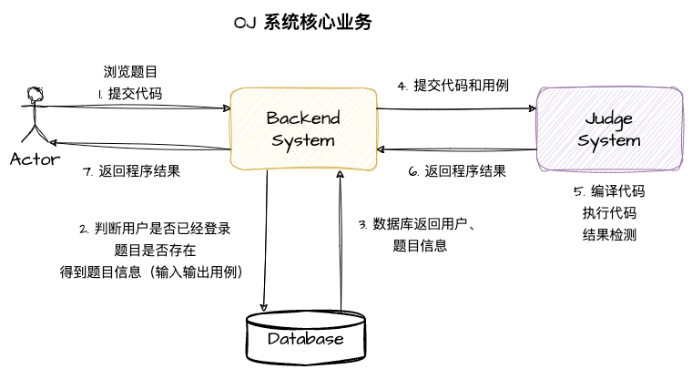
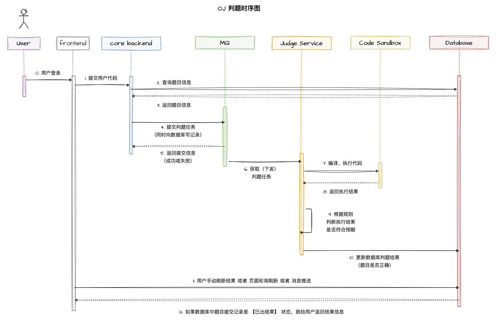
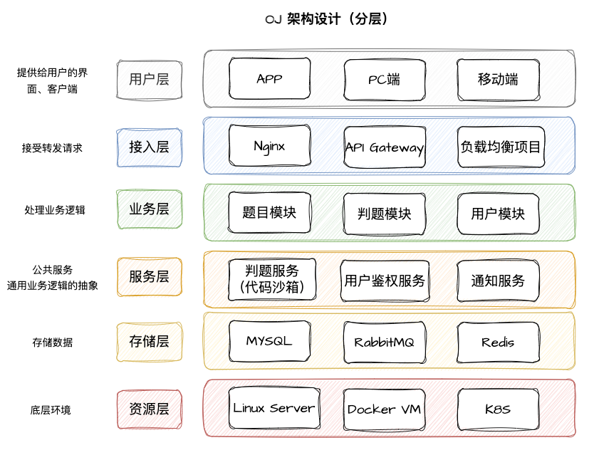

# JuOj

> 代码沙箱项目地址：https://github.com/dingxinliang88/code-sandbox

## 项目介绍

> OJ => Online Judge，在线判题系统

OJ（Online Judge）系统是一个在线编程评测系统，用户可以选择题目、编写代码并提交代码进行评测。然而，**OJ 系统的核心难点在于判题系统的设计与实现，需要能够编译、执行和评测用户代码，并与出题人设置的答案进行对比。**

目标是开发一个高效、稳定的 OJ 在线判题评测系统，支持多种编程语言，能够自动编译、执行和评测用户的代码。

## OJ 系统相关概念

### 核心概念

1）AC => 题目通过，结果正确
2）题目部分

1. 题目限制：时间限制、内存限制
2. 题目介绍
3. 题目输入
4. 题目输出
5. 题目输入用例
6. 题目输出用例

3）评测部分

1. 普通评测：管理员设置题目的输入和输出用例，比如输入用例为1，输出用例为2；交给判题机执行用户的代码，给用户的代码**喂**输入用例，比如1，看用户的执行结果是否和标准输出用例（比如2）一致（对比用例文件）
2. 特殊评测（SPJ）：管理员设置题目的输入和输出用例，比如输入1，用户的答案只要是 >0 或者 <2 都是正确的
3. 特判程序：不是通过对比用例文件是否一致这类死板的方式校验，而是要专门为这道题目写一个特殊的判断程序，比如：
    1. 程序接收题目的输入：1
    2. 标准输出用例：2
    3. 用户的输出结果：1.5

特判程序根据这些值来比较结果是否正确

4. 交互评测：让用户输入一个用例，就给出一个输出结果，交互比较灵活，没办法通过简单、死板的输入输出文件来解决

### 系统安全性

1）不允许让用户随便引入包、随意遍历、暴力破解，需要使用正确的算法

2）判题的过程是异步的，编译是需要时间的

3）提交之后，会生成一个提交记录，有运行结果及运行信息（时间、内存 => 题目有限制）


## 核心模块

### 核心业务梳理



### 判题时序图



**判题服务**：获取题目信息、预置的输入输出用例，返回给主业务后端：用户的答案是否正确

**代码沙箱**：只负责运行代码，给出程序运行的结果，不需要关心用户提交的程序是否正确。

=> 判题服务和代码沙箱之间实现了**解耦**


### 架构设计




## 项目核心亮点

1）**权限校验**

- 上传题目
- 后台调度

2）**代码沙箱（安全沙箱）**

- 为什么要实现？用户代码藏毒（比如写木马文件，修改系统权限）
- 沙箱环境：隔离的、安全的环境，用户的代码不会影响到沙箱之外系统的运行
- 资源分配：合理分配服务器的资源给多个模块、多个角色

3）**判题规则**

- 题目用例的比对、判断逻辑

4）**任务调度**

- 服务器资源有限，用户提交的代码需要排队，按照顺序依次判题，而不是直接拒绝掉超出资源限制的提交


## 文档

```sh
doc
├── Ju-OJ 前言 && 架构设计.md
├── Ju-OJ 数据库 && 接口设计.md
├── Ju-OJ 开发文档.md
├── api
├── assets
└── sql
```

- [SQL脚本](doc/sql/create_table.sql)
- [开发文档](doc/Ju-OJ 开发文档.md)


## 技术选型

1. Java进程管理
2. Java安全管理器
3. 虚拟机 / 云服务器
4. Docker => 代码沙箱
5. SpringBoot
6. MySQL && Redis
7. RabbitMQ
8. SpringCloud（后期改造）
