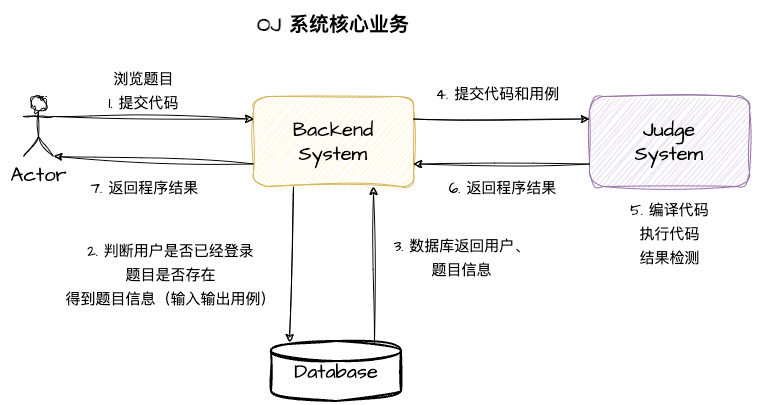
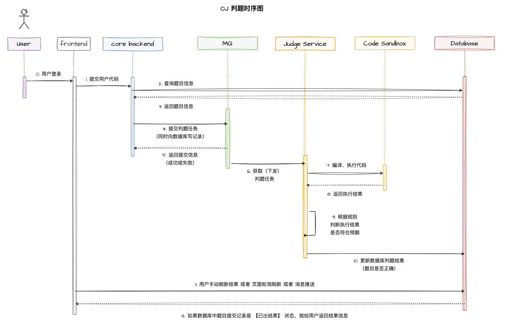
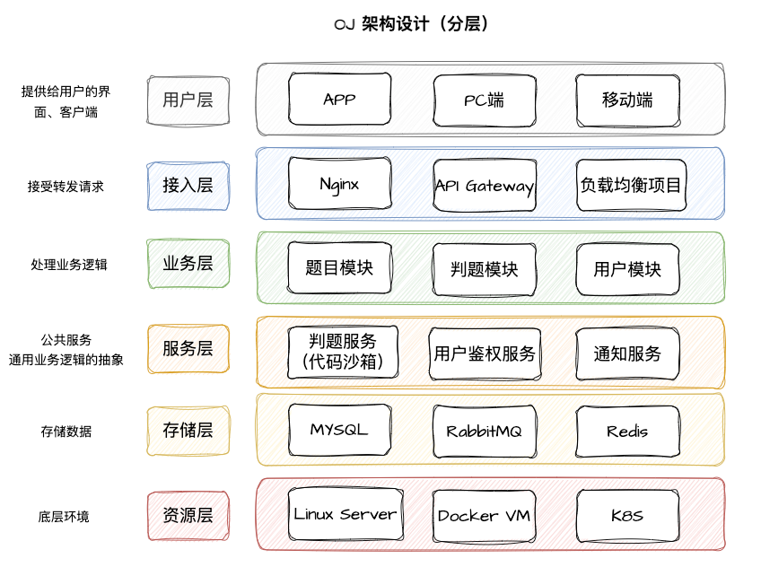

# 前言 && 架构设计

# 一、项目介绍

OJ => Online Judge，在线判题系统
用户可以选择题目、在线做题、编写并提交代码，系统会对用户提交的代码，根据预置的输入和输出，来判断用户提交的结果是否正确。

**难点：判题系统**

用于在线评测编程题目代码的系统，能够根据用户提交的代码、预置的题目输入和输出用例，进行编译、运行代码，并且判断运行结果是否正确。

比如：ACM（程序设计竞赛）、LeetCode（力扣网）

# 二、OJ 系统相关概念
## 2.1 核心概念
1）AC => 题目通过，结果正确
2）题目部分

1. 题目限制：时间限制、内存限制
2. 题目介绍
3. 题目输入
4. 题目输出
5. 题目输入用例
6. 题目输出用例

3）评测部分

1. 普通评测：管理员设置题目的输入和输出用例，比如输入用例为1，输出用例为2；交给判题机执行用户的代码，给用户的代码**喂**输入用例，比如1，看用户的执行结果是否和标准输出用例（比如2）一致（对比用例文件）
2. 特殊评测（SPJ）：管理员设置题目的输入和输出用例，比如输入1，用户的答案只要是 >0 或者 <2 都是正确的
3. 特判程序：不是通过对比用例文件是否一致这类死板的方式校验，而是要专门为这道题目写一个特殊的判断程序，比如：
   1. 程序接收题目的输入：1
   2. 标准输出用例：2
   3. 用户的输出结果：1.5

特判程序根据这些值来比较结果是否正确

4. 交互评测：让用户输入一个用例，就给出一个输出结果，交互比较灵活，没办法通过简单、死板的输入输出文件来解决

## 2.2 系统安全性
1）不允许让用户随便引入包、随意遍历、暴力破解，需要使用正确的算法

2）判题的过程是异步的，编译是需要时间的

3）提交之后，会生成一个提交记录，有运行结果及运行信息（时间、内存 => 题目有限制）

# 三、项目背景
OJ（Online Judge）系统是一个在线编程评测系统，用户可以选择题目、编写代码并提交代码进行评测。然而，OJ 系统的核心难点在于判题系统的设计与实现，需要能够编译、执行和评测用户代码，并与出题人设置的答案进行对比。

目标是开发一个高效、稳定的 OJ 在线判题评测系统，支持多种编程语言，能够自动编译、执行和评测用户的代码。

# 四、OJ 系统调研

1. [https://github.com/HimitZH/HOJ](https://github.com/HimitZH/HOJ) (适合学习)
2. [https://github.com/QingdaoU/OnlineJudge](https://github.com/QingdaoU/OnlineJudge) (python，不好学，很成熟)
3. [https://github.com/hzxie/voj](https://github.com/hzxie/voj) (星星没那么多，没那么成熟，但相对好学)
4. [https://github.com/fleaking/uoj](https://github.com/fleaking/uoj) (php实现的)
5. [https://github.com/zhblue/hustoj](https://github.com/zhblue/hustoj) (成熟，php实现)
6. [https://github.com/hydro-dev/Hydro](https://github.com/hydro-dev/Hydro) (功能强大，Node.js实现)

# 五、系统开发流程

1. 项目介绍、项目调研、需求分析
2. 核心业务流程
3. 功能模块梳理
4. 技术选型
5. 项目初始化
6. 项目开发
7. 测试
8. 优化
9. 代码提交、审核
10. 产品验收
11. 上线
> 写文档、持续调研、持续记录总结

# 六、项目核心亮点
1）权限校验

- 上传题目
- 后台调度

2）代码沙箱（安全沙箱）

- 为什么要实现？用户代码藏毒（比如写木马文件，修改系统权限）
- 沙箱环境：隔离的、安全的环境，用户的代码不会影响到沙箱之外系统的运行
- 资源分配：合理分配服务器的资源给多个模块、多个角色

3）判题规则

- 题目用例的比对、判断逻辑

4）任务调度

- 服务器资源有限，用户提交的代码需要排队，按照顺序依次判题，而不是直接拒绝掉超出资源限制的提交
# 七、项目功能梳理
## 7.1 已有功能
1）题目模块

管理员：

1. 创建题目
2. 删除题目
3. 修改题目

用户：

1. 搜索题目
2. 在线做题
3. 提交题目代码

2）用户模块

1. 注册
2. 登录
3. 用户管理（管理员）

3）判题模块

1. 提交判题（结果是否正确）
2. 错误处理（内存溢出、安全性、超时）
3. 自主实现代码沙箱（安全沙箱）
4. 开放接口（提供一个独立的新服务）

## 7.2 扩展功能

1. 支持多种语言
2. Remote Judge
3. 完善的评测功能：普通评测、特殊评测、交互评测、在线自测、子任务分组测评、文件
4. 统计分析用户判题记录
5. 权限校验

# 八、核心业务梳理

判题服务：获取题目信息、预置的输入输出用例，返回给主业务后端：用户的答案是否正确

代码沙箱：只负责运行代码，给出程序运行的结果，不需要关心用户提交的程序是否正确。

=> 判题服务和代码沙箱之间实现了解耦

# 九、架构设计

# 十、技术选型

## 前端
……

## 后端

1. Java进程管理
2. Java安全管理器
4. 虚拟机 / 云服务器
5. Docker => 代码沙箱
6. SpringBoot
7. MySQL && Redis
8. RabbitMQ
9. SpringCloud（后期改造）
